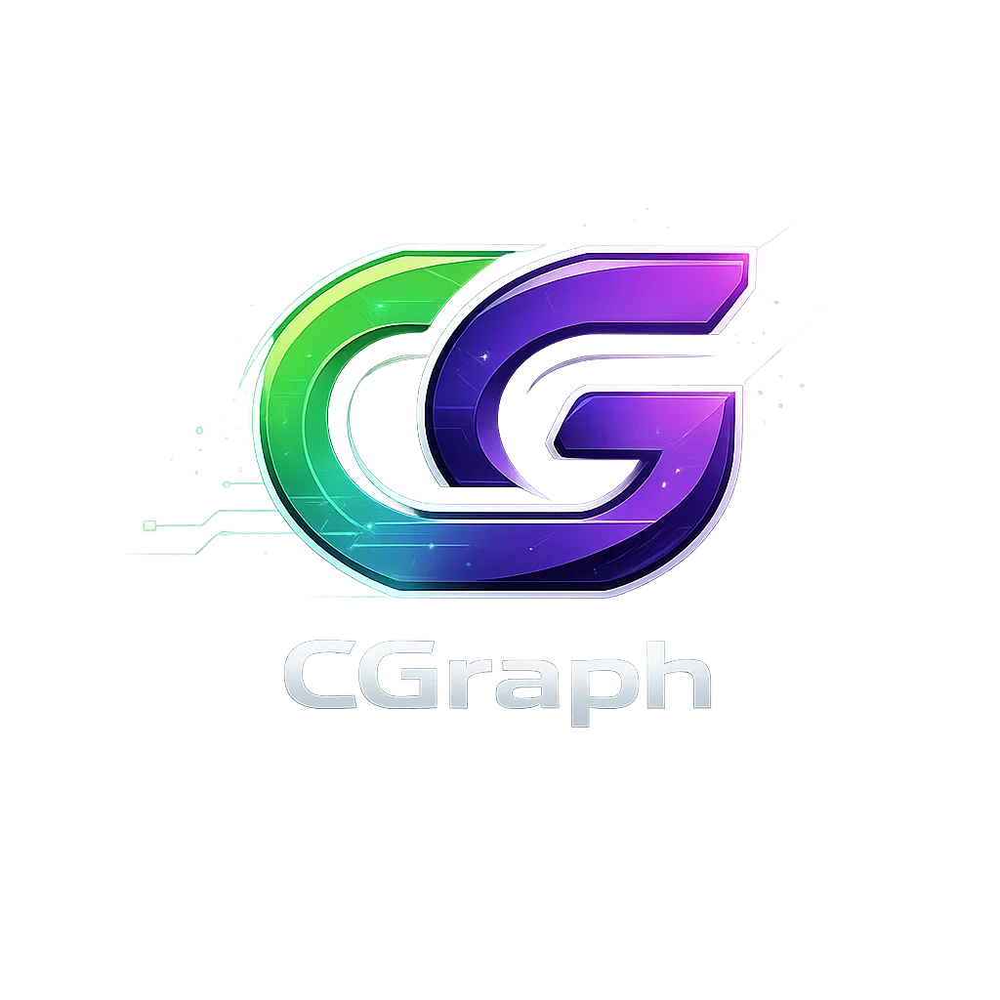

# CGraph

<div align="center">



### Secure messaging, forums, and gamification — in one app

#### Chat • Forums • E2EE • Leveling & achievements • Subscriptions

[](CHANGELOG.md)
[](#)
[](LICENSE)

**Current version:** 0.9.28 (February 2026)

[🌐 Website](https://cgraph.org) · [📚 Documentation](https://docs.cgraph.org) ·
[🔌 API Reference](https://api.cgraph.org/docs)

</div>

---

## ⚠️ Proprietary Software

CGraph is **proprietary software**. Self-hosting is not permitted. All users must access CGraph
through the officially hosted platform at [cgraph.org](https://cgraph.org).

See [LICENSE](LICENSE) for complete terms.

---

## Why CGraph?

| Feature                   |              CGraph              | Competitors |
| ------------------------- | :------------------------------: | :---------: |
| **End-to-End Encryption** |  ✅ PQXDH + Triple Ratchet (PQ)  |  ⚠️ Varies  |
| **OAuth Authentication**  |    ✅ Google, Apple, Facebook    |  ✅ Common  |
| **Community Forums**      |           ✅ Built-in            |     ❌      |
| **Gamification**          |   ✅ XP, Achievements, Quests    |     ❌      |
| **Subscription Tiers**    |   ✅ Free, Premium, Enterprise   |  ⚠️ Basic   |
| **Role Permissions**      |           ✅ Granular            |  ⚠️ Basic   |
| **Referral System**       | ✅ Tiered rewards & leaderboards |     ❌      |
| **Offline Support**       |    ✅ Full queue & auto-sync     | ⚠️ Limited  |

CGraph is a communication platform that puts chat, forums, and encryption together instead of making
you duct-tape three different apps. It also has an RPG-style leveling system because community
engagement shouldn't be boring.

---

## Features

### 💬 Real-Time Messaging

- Messages show up instantly — typing indicators, read receipts, the works
- E2EE via PQXDH + Triple Ratchet (post-quantum, based on Signal Protocol Rev 4)
- Voice messages with waveform visualization
- 1:1 and group calls over WebRTC (voice, video, screen share)
- Reactions, edits, deletes, forwarding, GIF search
- Syncs across web, iOS, and Android

### 🏢 Servers & Channels

- Organized servers with unlimited channels
- Channel categories for organization
- Custom roles with 20+ granular permissions
- Invite links with expiration and usage limits
- Audit logs for moderation
- Custom emoji support

### 📰 Community Forums

- Posts with upvote/downvote and karma
- Nested comments (no depth limit)
- Thread prefixes, categories, polls
- Leaderboards per forum
- Moderator tools (pin, lock, move, split, merge)
- Rich text editor + BBCode parser with syntax highlighting
- RSS/Atom feeds

### 🎮 Gamification

- **XP & Levels** — earn XP from chatting, posting, daily logins
- **30+ Achievements** across 6 categories (Social, Content, Exploration, Mastery, Legendary,
  Secret)
- **Daily/Weekly Quests** for bonus XP
- **Streaks** — 3+ days = 1.5x multiplier, 7+ = 2.0x
- **Titles & Badges** — cosmetic unlocks you can equip
- **Virtual Currency** — coins earned through activity, spent in the marketplace
- **Leaderboards** — global and per-forum
- **Seasonal Events** — limited-time challenges

### 🔐 Security

- **E2EE** — AES-256-GCM + PQXDH key exchange (ML-KEM-768 + P-256)
- **Triple Ratchet** — post-quantum forward secrecy, per-message key derivation
- **2FA** — TOTP with backup codes
- **OAuth** — Google, Apple, Facebook, TikTok
- **HTTP-only cookies** — no JS access to tokens
- **Trusted proxy validation** — stops IP spoofing behind Cloudflare
- **Magic byte file validation** — server checks actual file type, not just headers
- **Zero-knowledge** — server stores encrypted blobs, can't read messages
- **GDPR** — full data export and account deletion

### 💳 Subscription Tiers

| Tier           | Features                                              |
| -------------- | ----------------------------------------------------- |
| **Free**       | 5 forums/groups, basic features                       |
| **Starter**    | 10 forums/groups, custom themes                       |
| **Pro**        | 50 forums/groups, HD video, priority support          |
| **Business**   | Unlimited forums/groups, API access, analytics        |
| **Enterprise** | SSO/SAML, dedicated support, SLA, custom integrations |

### 📱 Mobile

- iOS and Android via React Native + Expo SDK 54
- Biometric auth (Face ID, fingerprint)
- Push notifications, camera integration
- Full offline support — queues messages/reactions while offline, syncs when you're back
- Exponential backoff on retries so it's not hammering the server

### 🎁 Referrals

- Referral codes with tiered rewards
- Leaderboards (daily, weekly, monthly, all-time)
- Track who signed up, claim rewards at each tier
- Native share sheets on iOS and Android

---

## Getting Started

Visit **[cgraph.org](https://cgraph.org)** to create your account and start using CGraph.

### Web App

Access CGraph directly in your browser at [app.cgraph.org](https://app.cgraph.org).

### Mobile Apps

- **iOS**: Download from the [App Store](https://apps.apple.com/app/cgraph)
- **Android**: Download from [Google Play](https://play.google.com/store/apps/details?id=app.cgraph)

### API Access

For developers, CGraph provides a public API. See our
[API Documentation](https://api.cgraph.org/docs).

```bash
# Example: Get current user
curl -H "Authorization: Bearer YOUR_TOKEN" https://api.cgraph.org/v1/me
```

---

## Pricing

| Plan           | Price      | Features                                              |
| -------------- | ---------- | ----------------------------------------------------- |
| **Free**       | $0/forever | Unlimited messaging, 5 forums/groups, basic features  |
| **Starter**    | $4.99/mo   | 10 forums/groups, custom themes, file sharing (50MB)  |
| **Pro**        | $9.99/mo   | 50 forums/groups, HD video calls, 200MB uploads       |
| **Business**   | $19.99/mo  | Unlimited forums/groups, API access, analytics, 1GB   |
| **Enterprise** | Custom     | SSO/SAML, dedicated support, SLA, custom integrations |

Visit [cgraph.org/pricing](https://cgraph.org/pricing) for full details.

---

## Tech Stack

| Layer      | Technology                                         |
| ---------- | -------------------------------------------------- |
| Backend    | Elixir 1.17+ / Phoenix 1.8 / PostgreSQL 16         |
| Web        | React 19 / Vite / TailwindCSS / Zustand            |
| Mobile     | React Native 0.81 / Expo SDK 54                    |
| Real-time  | Phoenix Channels (WebSocket)                       |
| Encryption | PQXDH + Triple Ratchet / AES-256-GCM / ML-KEM-768  |
| Payments   | Stripe (subscriptions, webhooks)                   |
| Hosting    | Fly.io (backend) / Vercel (web) / Cloudflare (CDN) |

---

## Architecture

CGraph splits the marketing site and the actual app into two separate builds:

```
┌──────────────────────┐              ┌──────────────────────┐
│     LANDING APP      │              │       WEB APP        │
│    cgraph.org        │              │   app.cgraph.org     │
│                      │              │                      │
│  • Marketing site    │   Login →    │  • Authenticated     │
│  • Pricing/Features  │  ─────────►  │  • Messages/Groups   │
│  • Legal pages       │              │  • Forums/Settings   │
│  • Company info      │              │  • Voice/Video       │
│                      │              │                      │
│   apps/landing/      │              │     apps/web/        │
└──────────────────────┘              └──────────────────────┘
          │                                      │
          └──────────────┬───────────────────────┘
                         │
                         ▼
              ┌──────────────────────┐
              │     BACKEND API      │
              │   api.cgraph.org     │
              │    (Fly.io)          │
              │                      │
              │  • Elixir/Phoenix    │
              │  • PostgreSQL        │
              │  • WebSocket         │
              │                      │
              │   apps/backend/      │
              └──────────────────────┘
```

### Why split them?

- **Size**: Landing page is ~200KB. The full app is ~2MB. Visitors reading the pricing page
  shouldn't download the crypto library.
- **SEO**: Landing pages need to be crawlable. The app is a client-side SPA behind auth.
- **Caching**: Landing gets CDN-cached globally. The app is dynamic.
- **Independence**: They deploy separately with different CI pipelines.

### Deployment

| App     | URL            | Vercel Project Root | Purpose           |
| ------- | -------------- | ------------------- | ----------------- |
| Landing | cgraph.org     | `apps/landing`      | Marketing, SEO    |
| Web App | app.cgraph.org | `apps/web`          | Authenticated app |
| Backend | api.cgraph.org | `apps/backend`      | API (Fly.io)      |

See [CLAUDE.md](CLAUDE.md) for detailed architecture documentation.

---

## Support

- **Help Center**: [help.cgraph.org](https://help.cgraph.org)
- **Email**: hello@cgraph.org
- **Status**: [status.cgraph.org](https://status.cgraph.org)

---

## Legal

- [Terms of Service](https://cgraph.org/terms)
- [Privacy Policy](https://cgraph.org/privacy)
- [License](LICENSE)

---

<div align="center">

**[cgraph.org](https://cgraph.org)**

© 2025-2026 CGraph. All Rights Reserved.

</div>
