# CGraph Architecture Diagrams

> **Version: 0.9.48** | Last Updated: March 12, 2026

Visual documentation of CGraph's system architecture.

---

## 1. High-Level System Architecture

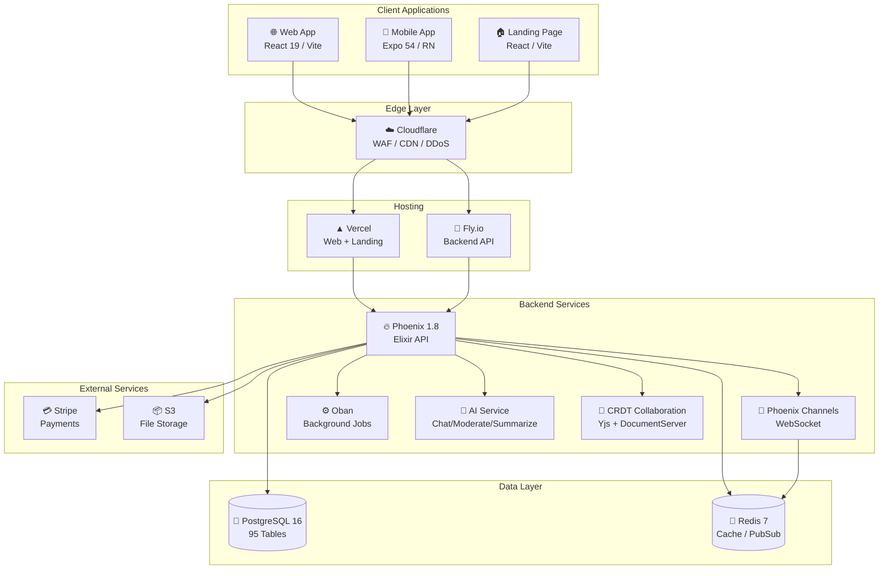

---

## 2. Dual-App Architecture ()

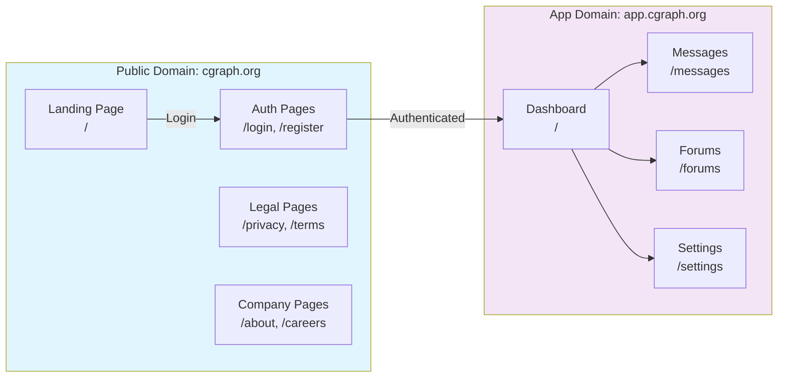

---

## 3. Real-Time Communication Flow

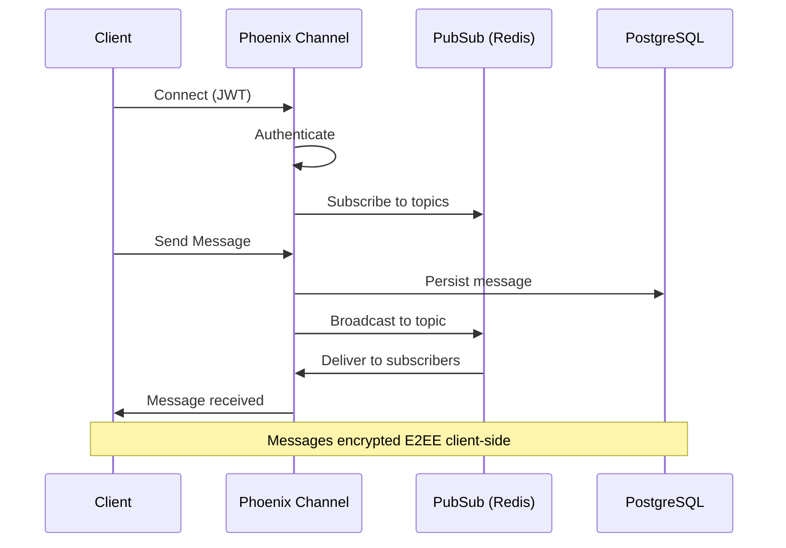

---

## 4. E2EE Message Flow (Triple Ratchet / PQXDH)

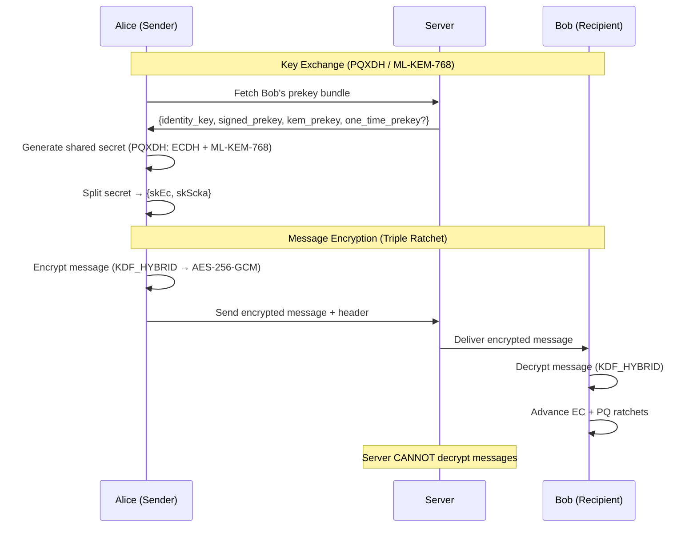

---

## 5. Monorepo Structure

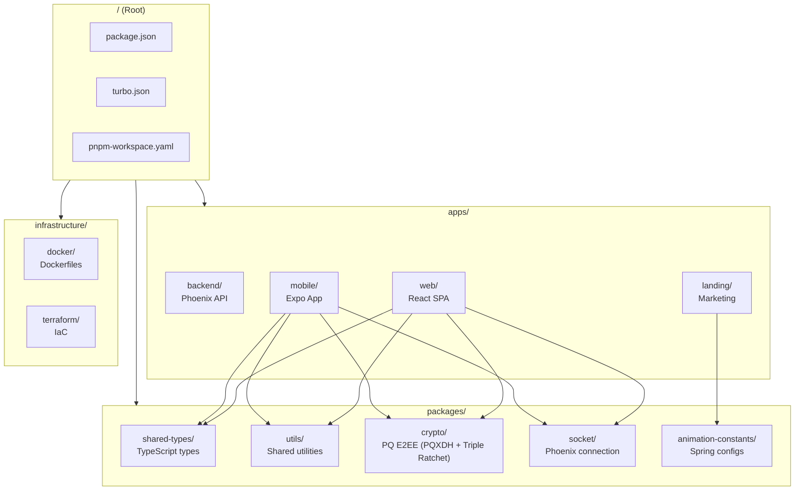

---

## 6. Database Schema Overview

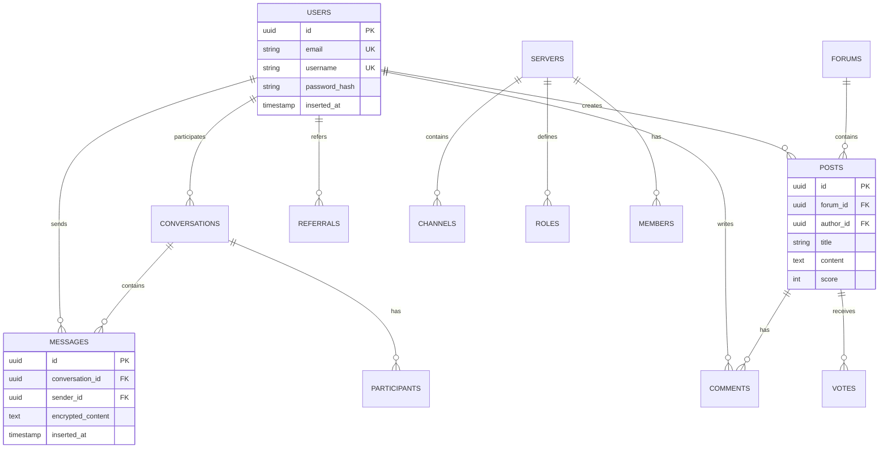

---

## 7. Phoenix Router Pipeline Architecture (v0.9.26)

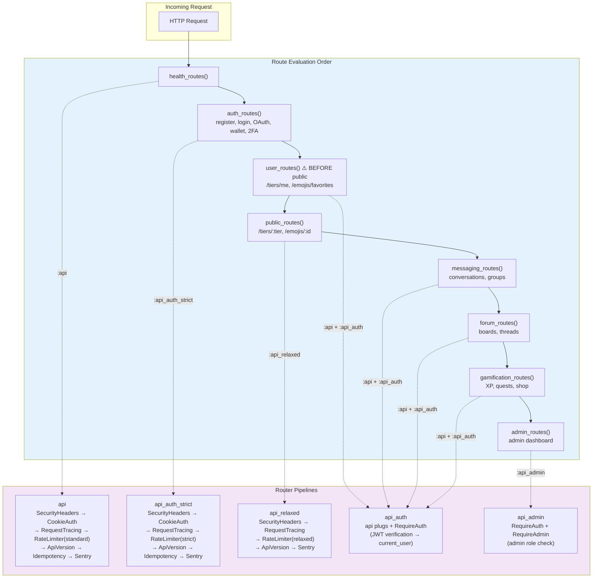

> **Critical**: `user_routes()` MUST evaluate before `public_routes()`. Public routes contain
> wildcard patterns (`/tiers/:tier`, `/emojis/:id`) that would shadow specific authenticated routes
> (`/tiers/me`, `/emojis/favorites`, `/emojis/recent`).

---

## 8. Authentication Flow

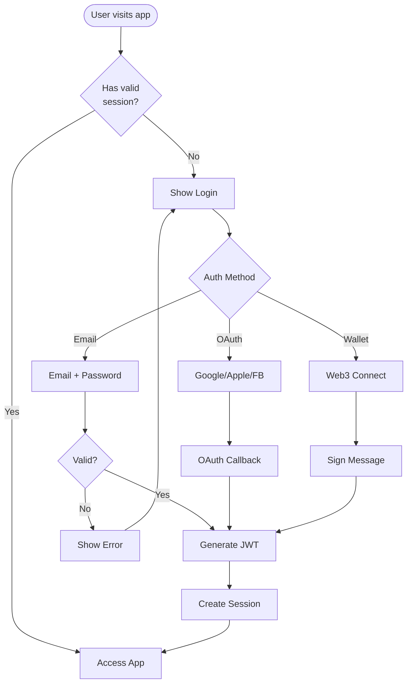

---

## 9. Deployment Pipeline

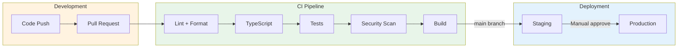

---

## 10. State Management (Zustand Stores)

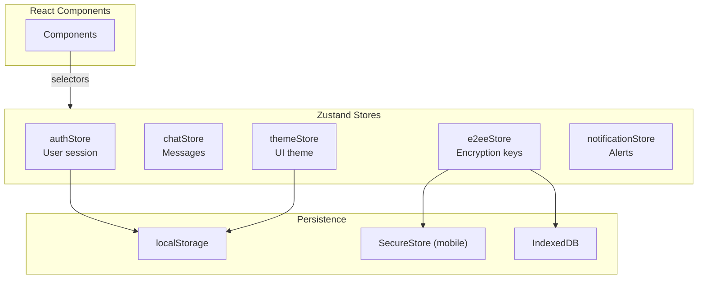

---

## 11. Facade Hook Architecture

```mermaid
flowchart TB
    subgraph Facades["Domain Facade Hooks"]
        AF["useAuthFacade<br/>Auth + Session"]
        CF["useChatFacade<br/>Messages + Effects"]
        GF["useGamificationFacade<br/>XP + Prestige + Events"]
        SF["useSettingsFacade<br/>Preferences + Theme"]
        CMF["useCommunityFacade<br/>Forums + Groups"]
        MF["useMarketplaceFacade<br/>Listings + Borders"]
        UF["useUIFacade<br/>Notifications + Search"]
    end

    subgraph Stores["Zustand Stores (Primitive Selectors)"]
        AS["authStore"]
        CS["chatStore"]
        CES["chatEffectsStore"]
        CBS["chatBubbleStore"]
        GS["gamificationStore"]
        PS["prestigeStore"]
        SES["seasonalEventStore"]
        RS["referralStore"]
        SS["settingsStore"]
        CUS["customizationStore"]
        TS["themeStore"]
        FS["forumStore"]
        GRS["groupStore"]
        ANS["announcementStore"]
        MS["marketplaceStore"]
        ABS["avatarBorderStore"]
        NS["notificationStore"]
        SRS["searchStore"]
        CAS["calendarStore"]
    end

    subgraph Components["React Components"]
        COMP["Components use facades<br/>not stores directly"]
    end

    COMP --> Facades
    AF --> AS
    CF --> CS
    CF --> CES
    CF --> CBS
    GF --> GS
    GF --> PS
    GF --> SES
    GF --> RS
    SF --> SS
    SF --> CUS
    SF --> TS
    CMF --> FS
    CMF --> GRS
    CMF --> ANS
    MF --> MS
    MF --> ABS
    UF --> NS
    UF --> SRS
    UF --> CAS

    style Facades fill:#10b981,color:#fff
    style Stores fill:#3b82f6,color:#fff
    style Components fill:#8b5cf6,color:#fff
```

**Pattern**: Components → Facade Hook → Multiple Stores. Each facade uses primitive selectors
(individual field subscriptions) to prevent re-render storms, then returns a stable `useMemo`'d
object.

---

## 12. Socket Module Architecture

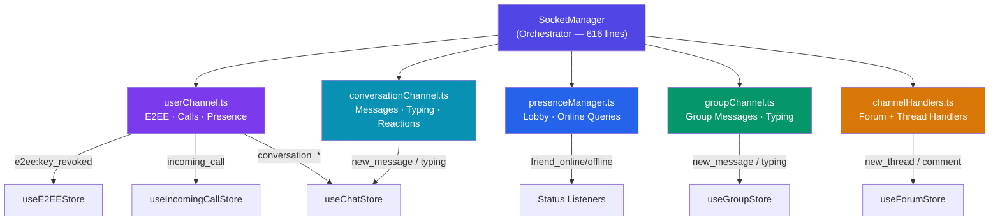

> Each channel module is a **pure function** that receives socket state references and wires up
> Phoenix channel event handlers. The SocketManager delegates via thin wrapper methods, preserving
> the same public API while splitting a 960-line monolith into 5 focused modules.

---

## 13. Request Flow

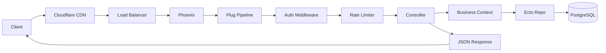

---

## Diagram Legend

| Symbol | Meaning            |
| ------ | ------------------ |
| 🌐     | Web application    |
| 📱     | Mobile application |
| 🔥     | Phoenix/Elixir     |
| 🐘     | PostgreSQL         |
| 🔴     | Redis              |
| ☁️     | Cloud service      |
| 💳     | Payment service    |
| 📦     | Storage service    |

---

## 14. AI Service Architecture (v0.9.34)

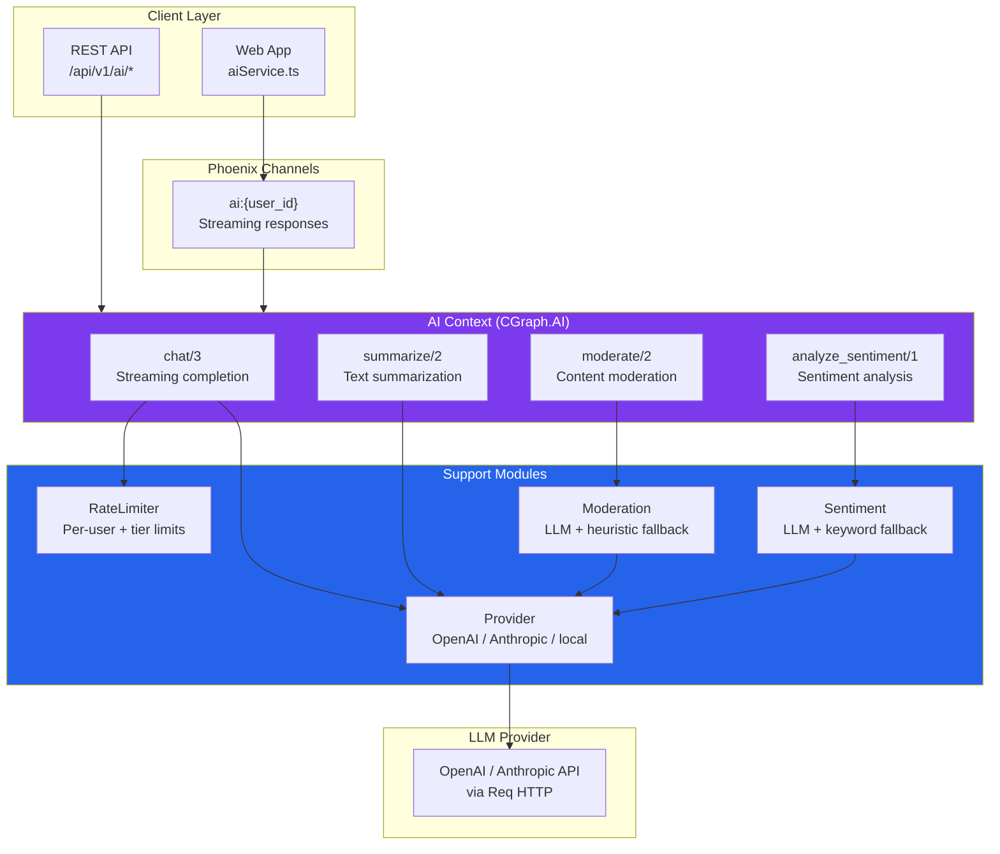

---

## 15. CRDT Collaboration Architecture (v0.9.34)

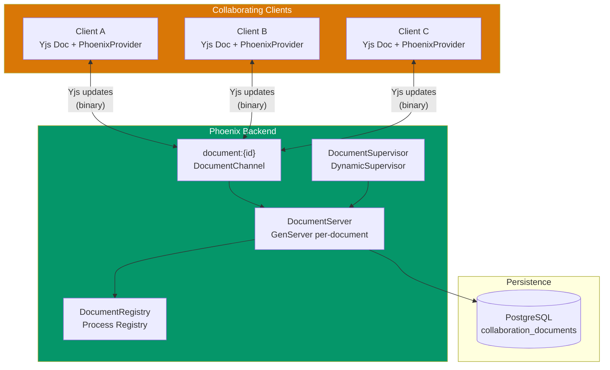

> **Pattern:** Each document gets a dedicated GenServer (started on-demand via DynamicSupervisor).
> The server holds the Yjs document state, merges incoming updates, broadcasts to all connected
> clients, and periodically persists snapshots to PostgreSQL.

---

## 16. Offline-First Mobile Architecture (v0.9.34)

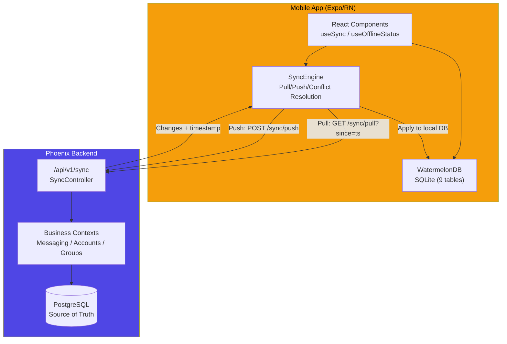

> **Sync Protocol:** Last-write-wins with server timestamps. Mobile pulls all changes since last
> sync timestamp, applies them to WatermelonDB, then pushes locally created/modified records. The
> server resolves conflicts using `updated_at` comparison. Nine tables synced: users, conversations,
> messages, participants, groups, group_members, group_messages, channels, and notifications.

---

## 17. Cosmetics & Unlock Engine Architecture (Phase 33 + 35)

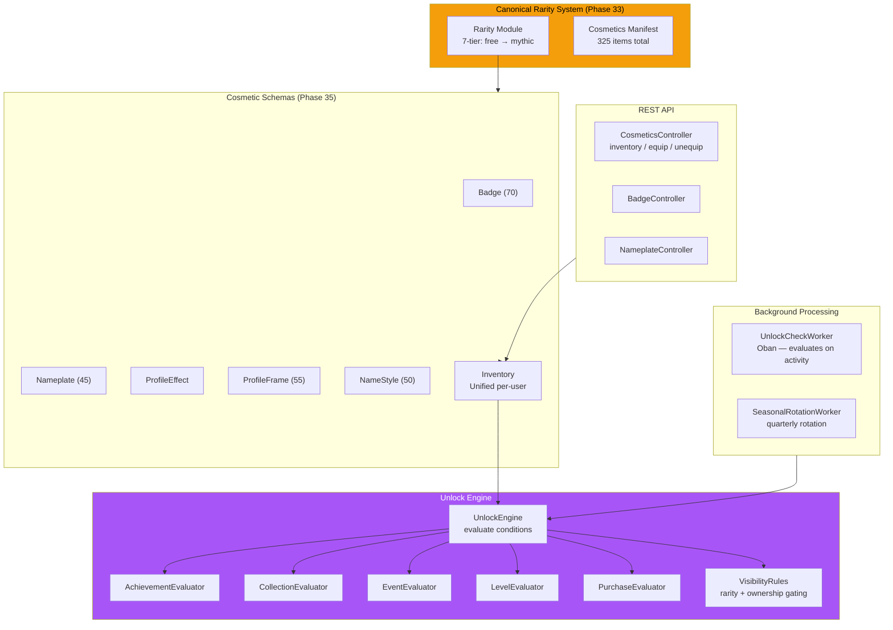

> **Phase 33** unified rarity to 7 tiers and created the cosmetics manifest (325 items). **Phase 35** implemented all schemas, the unlock engine with 5 evaluators, unified inventory, API controllers, and frontend UI (web + mobile).

---

## 18. Creator Economy Architecture (Phase 36)

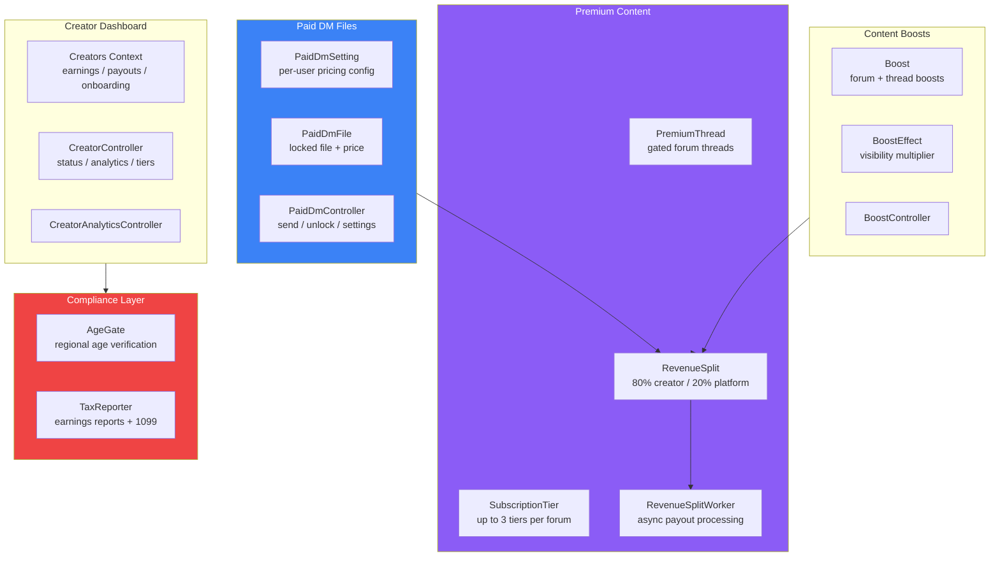

> **Phase 36** added the full creator economy: paid DM file monetization, premium threads with subscription tiers, content boosts, revenue splits (80/20), compliance layer (AgeGate + TaxReporter), GDPR export extension, and creator dashboard UI on web + mobile.

---

## 19. Forum Transformation Architecture (Phase 37)

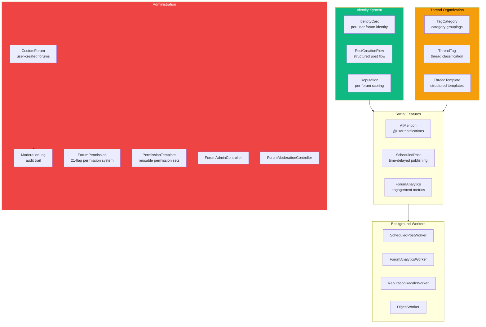

> **Phase 37** transformed forums with identity cards, thread tags/categories, @mentions, templates, analytics, scheduled posts, custom forums, moderation log, extended permissions (21 flags + templates), and full web + mobile UI (13+ web components, 12+ mobile components).

---

## 20. Infrastructure Scaling Architecture (Phase 38)

```mermaid
flowchart TB
    subgraph Sharding["Database Sharding"]
        SM["ShardManager<br/>GenServer"]
        CH["ConsistentHash<br/>256 vnodes / ring"]
        SR["ShardRouter<br/>route(table, key, mode)"]
        SMIG["ShardMigration<br/>split / merge / verify"]
        SM --> CH
        SR --> SM
        SMIG --> SM
    end

    subgraph Caching["Multi-Tier Cache"]
        MTC["MultiTierCache<br/>build_key / fetch / put"]
        L1["L1 — ETS<br/>1 min TTL"]
        L2["L2 — Cachex<br/>15 min TTL"]
        L3["L3 — Redis<br/>24 h TTL"]
        CW["CacheWarmer<br/>boot + periodic"]
        CI["CacheInvalidator<br/>PubSub-driven"]
        MTC --> L1 --> L2 --> L3
        CW --> MTC
        CI --> MTC
    end

    subgraph Queues["Queue & Search"]
        PQ["PriorityQueue<br/>critical / high / normal / low"]
        DLQ["DeadLetterQueue<br/>ETS + admin API"]
        EA["ElasticAdapter<br/>ES / OpenSearch / pg fallback"]
        SI["SearchIndexer<br/>bulk indexing"]
        PQ --> DLQ
        EA --> SI
    end

    subgraph Monitoring["Monitoring Stack"]
        HD["HealthDashboard<br/>component status"]
        AL["Alerting<br/>Slack + PagerDuty"]
        MC["MetricsCollector<br/>SLO tracking"]
        HD --> AL
        MC --> AL
    end

    subgraph Operations["Operations Toolkit"]
        RB["Runbook<br/>define_runbook macro"]
        CP["CapacityPlanner<br/>linear regression"]
        DR["DisasterRecovery<br/>failover / promote"]
        PP["PerformanceProfiler<br/>flame graph / slow queries"]
    end

    subgraph Archival["Data Archival"]
        AP["ArchivePolicy<br/>365-day threshold"]
        AR["Archival Context<br/>archive / restore"]
        AW["ArchivalWorker<br/>monthly Oban cron"]
        AP --> AR --> AW
    end

    subgraph CDN["CDN Management"]
        CM["CDNManager<br/>R2 / S3 backend"]
        IO["ImageOptimizer<br/>resize / WebP / srcset"]
        CM --> IO
    end

    subgraph Presence["Distributed Presence"]
        DP["DistributedPresence<br/>CRDT multi-node"]
    end
```

> **Phase 38 adds 26 Elixir modules** across 8 subsystems covering database sharding,
> multi-tier caching, data archival, priority queues, search infrastructure, distributed
> presence, CDN management, monitoring, and operations toolkit. All modules are optionally
> enabled via runtime configuration.

---

**CGraph Architecture Diagrams** • Version 0.9.48 • Last updated: March 12, 2026
