# CGraph Architecture Diagrams

> **Version: 0.9.26** | Last Updated: February 16, 2026

Visual documentation of CGraph's system architecture.

---

## 1. High-Level System Architecture

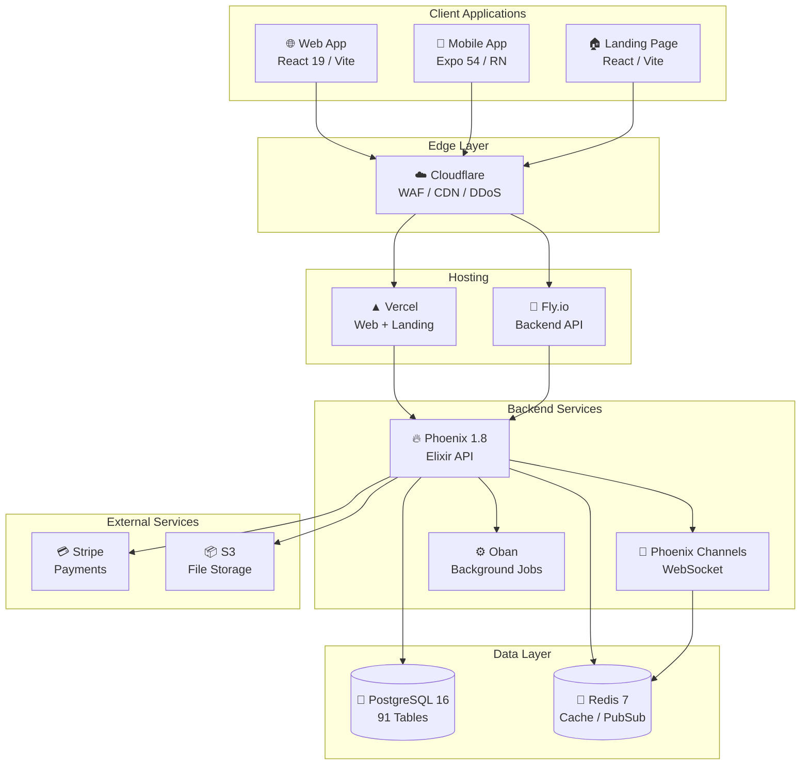

---

## 2. Dual-App Architecture ()

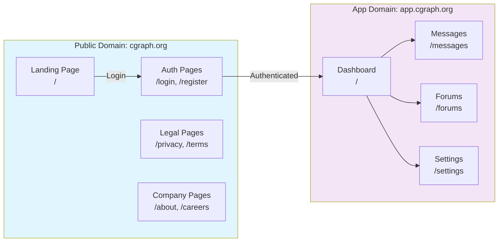

---

## 3. Real-Time Communication Flow

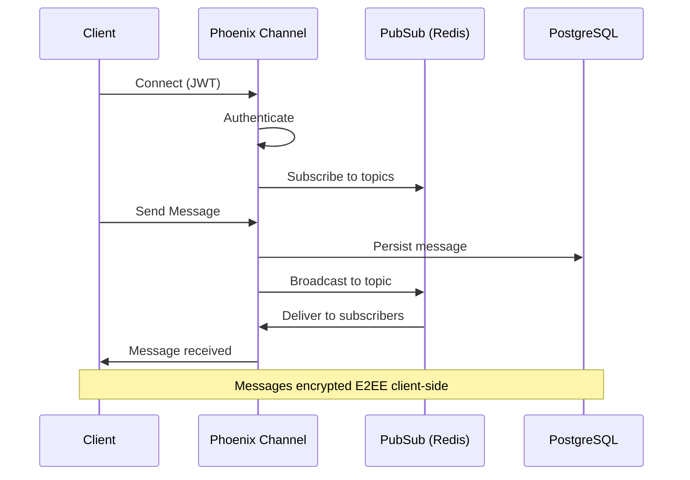

---

## 4. E2EE Message Flow (Signal Protocol)

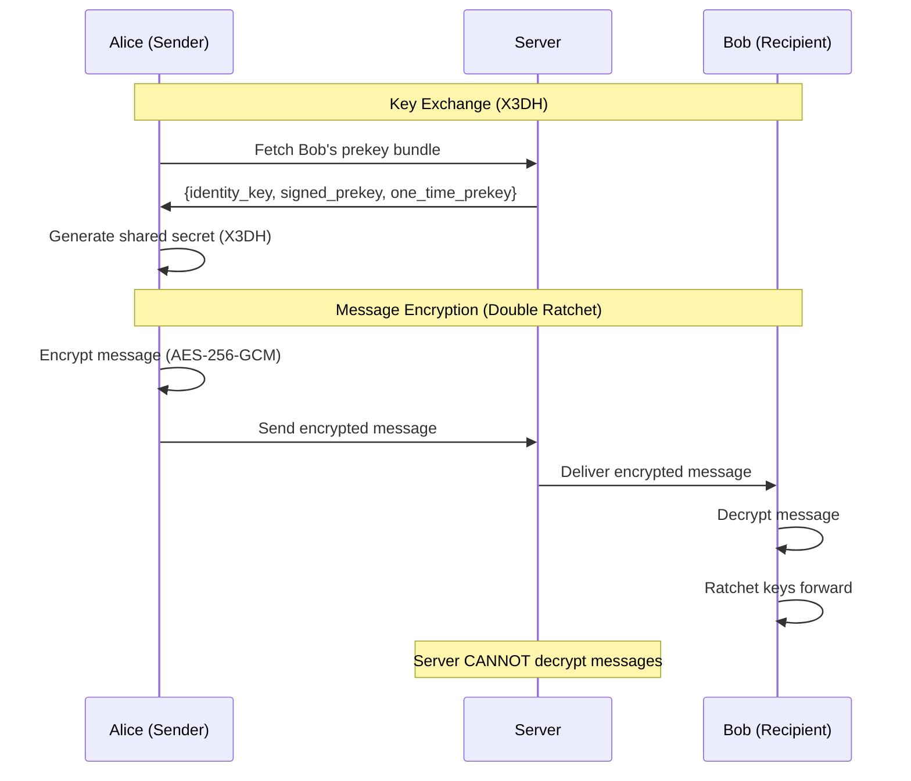

---

## 5. Monorepo Structure

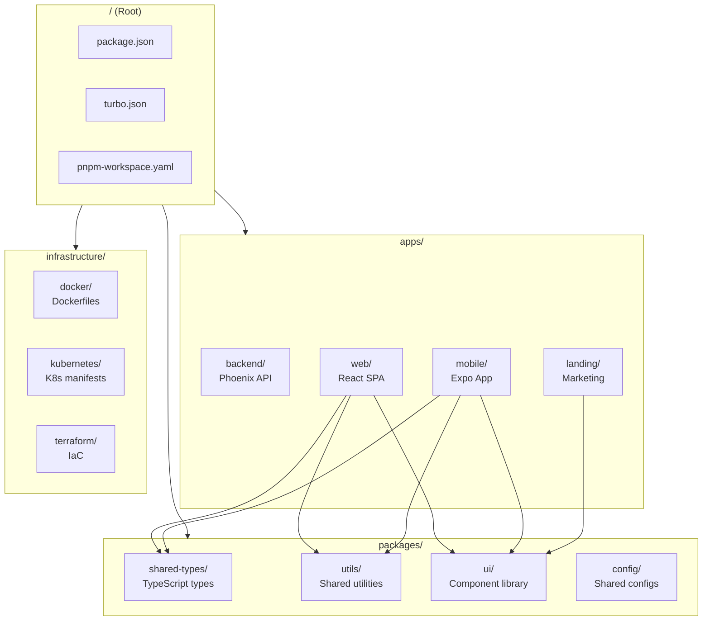

---

## 6. Database Schema Overview

---

## 7. Phoenix Router Pipeline Architecture (v0.9.26)

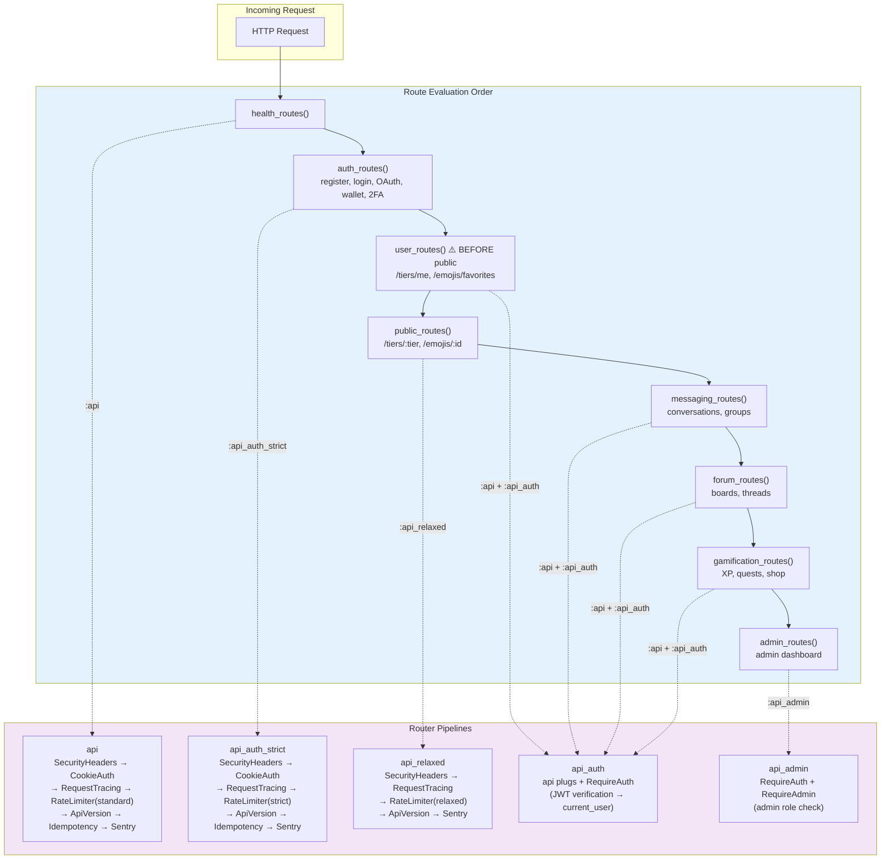

> **Critical**: `user_routes()` MUST evaluate before `public_routes()`. Public routes contain
> wildcard patterns (`/tiers/:tier`, `/emojis/:id`) that would shadow specific authenticated routes
> (`/tiers/me`, `/emojis/favorites`, `/emojis/recent`).

---

## 8. Authentication Flow

---

## 9. Deployment Pipeline

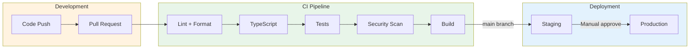

---

## 10. State Management (Zustand Stores)

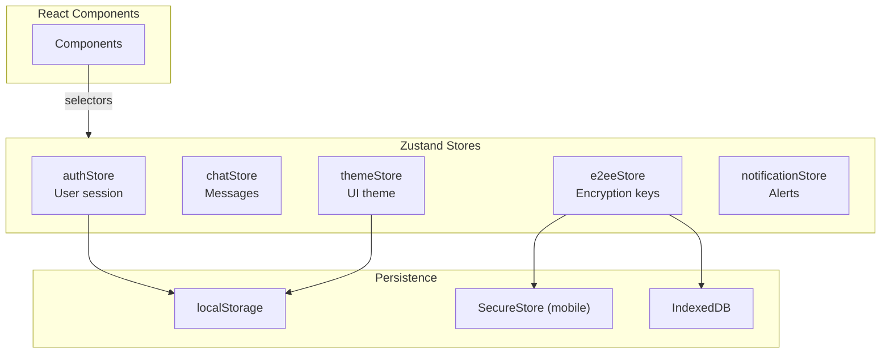

---

## 11. Facade Hook Architecture

```mermaid
flowchart TB
    subgraph Facades["Domain Facade Hooks"]
        AF["useAuthFacade<br/>Auth + Session"]
        CF["useChatFacade<br/>Messages + Effects"]
        GF["useGamificationFacade<br/>XP + Prestige + Events"]
        SF["useSettingsFacade<br/>Preferences + Theme"]
        CMF["useCommunityFacade<br/>Forums + Groups"]
        MF["useMarketplaceFacade<br/>Listings + Borders"]
        UF["useUIFacade<br/>Notifications + Search"]
    end

    subgraph Stores["Zustand Stores (Primitive Selectors)"]
        AS["authStore"]
        CS["chatStore"]
        CES["chatEffectsStore"]
        CBS["chatBubbleStore"]
        GS["gamificationStore"]
        PS["prestigeStore"]
        SES["seasonalEventStore"]
        RS["referralStore"]
        SS["settingsStore"]
        CUS["customizationStore"]
        TS["themeStore"]
        FS["forumStore"]
        GRS["groupStore"]
        ANS["announcementStore"]
        MS["marketplaceStore"]
        ABS["avatarBorderStore"]
        NS["notificationStore"]
        SRS["searchStore"]
        CAS["calendarStore"]
    end

    subgraph Components["React Components"]
        COMP["Components use facades<br/>not stores directly"]
    end

    COMP --> Facades
    AF --> AS
    CF --> CS
    CF --> CES
    CF --> CBS
    GF --> GS
    GF --> PS
    GF --> SES
    GF --> RS
    SF --> SS
    SF --> CUS
    SF --> TS
    CMF --> FS
    CMF --> GRS
    CMF --> ANS
    MF --> MS
    MF --> ABS
    UF --> NS
    UF --> SRS
    UF --> CAS

    style Facades fill:#10b981,color:#fff
    style Stores fill:#3b82f6,color:#fff
    style Components fill:#8b5cf6,color:#fff
```

**Pattern**: Components → Facade Hook → Multiple Stores. Each facade uses primitive selectors
(individual field subscriptions) to prevent re-render storms, then returns a stable `useMemo`'d
object.

---

## 12. Socket Module Architecture

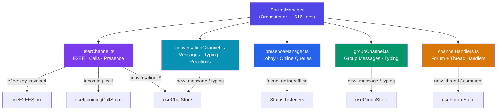

> Each channel module is a **pure function** that receives socket state references and wires up
> Phoenix channel event handlers. The SocketManager delegates via thin wrapper methods, preserving
> the same public API while splitting a 960-line monolith into 5 focused modules.

---

## 13. Request Flow

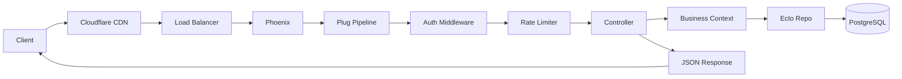

---

## Diagram Legend

| Symbol | Meaning            |
| ------ | ------------------ |
| 🌐     | Web application    |
| 📱     | Mobile application |
| 🔥     | Phoenix/Elixir     |
| 🐘     | PostgreSQL         |
| 🔴     | Redis              |
| ☁️     | Cloud service      |
| 💳     | Payment service    |
| 📦     | Storage service    |

---

**CGraph Architecture Diagrams** • Version 0.9.26 • Last updated: February 16, 2026
